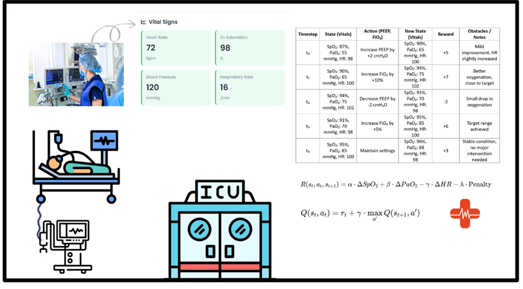

# Reinforcement Learning for Real-Time ICU Ventilator Management

This project applies advanced Reinforcement Learning (RL) techniques to assist clinicians in optimizing ventilator settings for intubated COVID-19 patients in the ICU. We focus on real-time, safe, and interpretable clinical decision support using models trained on data from the Dutch ICU Data Warehouse.

---

## Project Highlights

- **RL Models Used**:  
  - Dueling Double Deep Q-Network (Dueling DDQN)  
  - Soft Actor-Critic (SAC) with entropy regularization

- **Dataset**:  
  - Dutch ICU Data Warehouse  
  - 1,118 adult ICU admissions with intubated COVID-19 patients

- **Models Trained**:  
  - 69,000+ unique policy variations evaluated using Cross Off-Policy Evaluation (Cross-OPE)

---

## Key Features

### Real-Time Decision Support Dashboard
- Recommends optimal **PEEP** and **FiO₂** ventilator settings
- Visual confidence feedback using a **traffic-light system**
- Embedded **safety checks** via policy restrictions

### Cross-OPE Policy Evaluation
- Compares model performance across 69,000 trained policies
- Flags policies with <5% deviation from clinician decisions in critical scenarios

### Clinician-AI Collaboration
- “What-if” simulation panel for testing hypothetical adjustments
- Tracks model rationale (e.g., *“Increased PEEP due to declining PF ratio”*)
- Real-time **mortality risk** estimates based on training cohort

### Performance Benchmarking
- Compare RL-based recommendations against existing clinical protocols
- Project 6-hour trajectories of key vitals like PaO₂/FiO₂, SpO₂, and HR

---

## Example Use Case

> **Patient Condition**: COVID-19 ARDS with PF ratio < 150  
> **Model Recommendation**: Increase PEEP by 5cmH₂O  
> **Projected Outcome**:  
> - +12% PaO₂ improvement  
> - <3% barotrauma risk  
> **Clinician Action Required**: Manual confirmation before implementation  

---

## System Architecture

- Data from the ICU Data Warehouse → Preprocessed and aggregated  
- RL models generate recommendations → Sent to a real-time monitoring dashboard  
- Clinician validates and confirms before deployment  

---

## Technologies Used

- **Python** for model development
- **PyTorch** and **TensorFlow** for RL training
- **Flask** / **FastAPI** for backend integration
- **Html** dashboard with real-time updates
- **Matplotlib**, **Seaborn**, and **Plotly** for visual analytics

